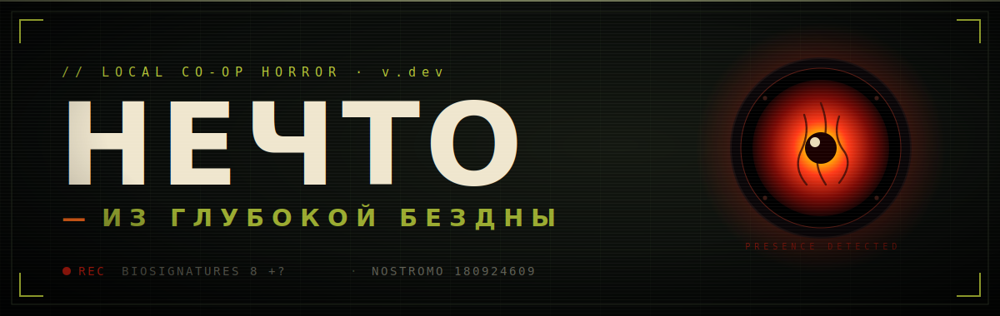

<!-- ════════════════════════════════════════════════════════════════ -->
<!--  НЕЧТО · README — assets/ должна лежать рядом с этим файлом         -->
<!-- ════════════════════════════════════════════════════════════════ -->

<a href="https://github.com/bigmeco/NECHTO/releases/tag/dev">
  
</a>

<div align="center">

[](https://github.com/bigmeco/NECHTO/releases/tag/dev)
[](#как-играть)
[](#требования)
[](#как-играть)
[](#лицензия)

<br>

**ПРОТОКОЛ ЗАРАЖЕНИЯ** · Локальный цифровой симулятор настольной игры в стиле Jackbox.
Один ноутбук на телевизоре — телефоны игроков как пульты.

<sub>` ● rec ` Биосигнатуры стабильны. Почти все. Почти.</sub>

</div>

---

<div align="center">
  
  <br>
  <sub><code>:desktopApp</code> · общий стол 1920×1080 — то, что видят все игроки на большом экране. Без секретной информации.</sub>
</div>

---

## Как играть
<a id="как-играть"></a>

| | |
|:--:|:--|
| **01** | Хост запускает приложение на ноутбуке / Steam Deck — экран выводится на **ТВ**. |
| **02** | Игроки сканируют **QR-код** на экране со своих телефонов *(Chrome / Firefox)*. |
| **03** | Раздача карт, ходы, обмены — всё **с телефона**. Большой экран — общая память корабля. |

> **4–12 игроков · общий Wi-Fi · без регистрации, без аккаунтов, без интернета.**
> Корабль герметичен. Связь — только внутри отсека.

---

## Правила за 30 секунд

<details>
<summary><b>▸ Что вообще происходит</b></summary>

<br>

Среди экипажа есть **Нечто** — то, что носит чужое лицо. Оно распространяется
через **обмен картами** с соседом по направлению хода. Заражённый обязан держать
карту `ЗАРАЖЕНИЕ` на руке до конца партии.

**Ход:** тянешь карту → разыгрываешь или сбрасываешь → меняешься картой с соседом.

**Кто побеждает:**
- **Экипаж** — если Нечто уничтожено огнемётом.
- **Нечто** — если все незаражённые люди инфицированы, или остаётся схватка один на один с человеком.

Обмен идёт **только с соседом** — но соседей можно менять, блокировать и сжигать.

<sub>«Я полностью функционален. И я очень рад вас видеть.»</sub>

</details>

<details>
<summary><b>▸ Карты, которые всё решают</b></summary>

<br>

| Карта | Действие | <sub>бортовой журнал</sub> |
|:--|:--|:--|
| 🔴 **Заражение** | Передаётся при обмене — носитель держит её до конца. | <sub>*Шлем герметичен. Это уже не помогает.*</sub> |
| 🟢 **Карантин** | Сосед 3 хода не меняется картами и не разыгрывает карты действий. | <sub>*Пристёгнут. Кричать в кляп бесполезно.*</sub> |
| 🟠 **Огнемёт** | Соседний игрок выбывает из игры. Защита — «Никакого шашлыка!» | <sub>*Клянусь, сожгу любого, кто приблизится.*</sub> |
| ⬜ **Заколоченная дверь** | Между вами и соседом — ни обменов, ни карт действий. Снимается топором. | <sub>*Сварено, забито, окрашено.*</sub> |
| 🔵 **Анализ** | Посмотрите все карты на руке выбранного соседа. | <sub>*…а теперь посмотрим, кто ты на самом деле.*</sub> |
| 🟣 **Подозрение** | Подсмотрите 1 случайную карту соседа. | <sub>*Он сел левшой. Трижды взял кружку правой.*</sub> |

<sub>Полный список карт — внутри приложения. Паника тянется отдельной колодой.</sub>

</details>

---

## Скачать
<a id="скачать"></a>

| Платформа | Файл |
|:--|:--|
| 🐧 **Steam Deck / Linux** | [Releases →](https://github.com/bigmeco/NECHTO/releases/tag/dev) |
| 🍎 **macOS** | [Releases →](https://github.com/bigmeco/NECHTO/releases/tag/dev) |
| 🪟 **Windows** `.msi` | [Releases →](https://github.com/bigmeco/NECHTO/releases/tag/dev) |
| 🪟 **Windows** `.zip` | [Releases →](https://github.com/bigmeco/NECHTO/releases/tag/dev) |

---

## Установка · Windows
<a id="установка-windows"></a>

**Вариант A — установщик `.msi` *(рекомендуется)*:**

1. Скачать `Nechto-*.msi` из Releases.
2. Запустить — пройти стандартный мастер установки Windows.
3. Ярлык **Nechto** появится в меню «Пуск».

> Если Windows SmartScreen показывает предупреждение — нажать **«Подробнее» → «Всё равно запустить»**.
> Приложение не подписано сертификатом издателя (dev-версия).

**Вариант Б — портативный `.zip` *(без установки)*:**

1. Скачать `nechto-windows.zip` из Releases.
2. Распаковать в любую папку.
3. Запустить `Nechto.exe` внутри.

Права администратора не нужны, в реестр ничего не пишется.

---

## Установка · Steam Deck
<a id="установка"></a>

```bash
tar -xzf nechto-linux-steamdeck.tar.gz -C ~/nechto
cd ~/nechto
bash install.sh
```

После `install.sh` ярлык появится в меню приложений **Desktop Mode**.

---

## Установка · macOS

Скачать `.dmg`, перетащить **Нечто.app** в `/Applications`.

При первом запуске macOS может заблокировать приложение — откройте через
**ПКМ → Открыть** или выполните в терминале:

```bash
xattr -cr /Applications/Нечто.app
```

---

## Требования
<a id="требования"></a>

| Узел | Что нужно |
|:--|:--|
| 🖥️ **Хост** | любой ноутбук / Steam Deck с Wi-Fi |
| 📱 **Игроки** | телефон с **Chrome** или **Firefox** *(Safari не поддерживается)* |
| 📡 **Сеть** | общая Wi-Fi — корабль работает без выхода наружу |

---

<a id="лицензия"></a>
<div align="center">
<sub>

`MODULE :desktopApp` · `SHARED STATE V3` · `CONN: SECURED`

**НЕЧТО** — ПРОТОКОЛ ЗАРАЖЕНИЯ · © 2026 · MIT

<i>«Только не передавай мне ничего зелёного.»</i>

</sub>
</div>
