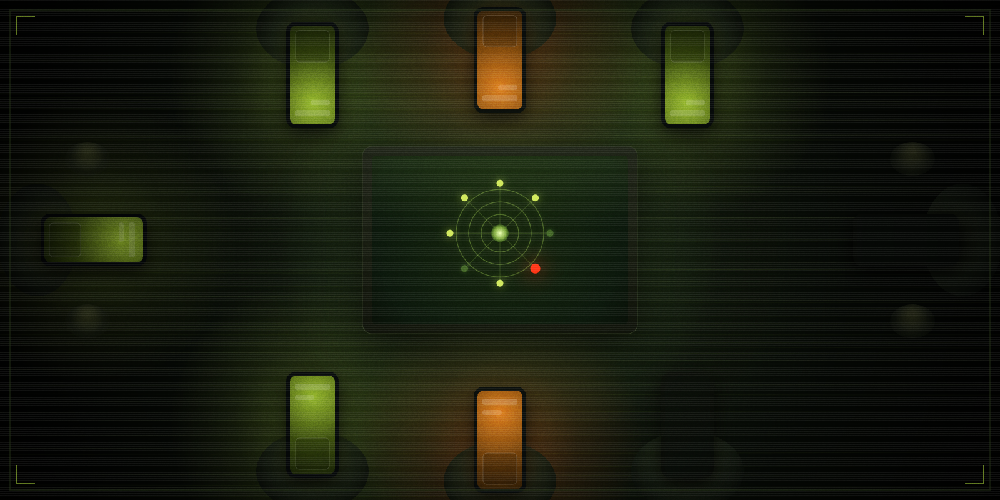

<a href="https://github.com/bigmeco/NECHTO/releases/tag/dev">
  
</a>

<div align="center">

[](https://github.com/bigmeco/NECHTO/releases/tag/dev)
[](#как-играть)
[](#требования)
[](#как-играть)
[](#лицензия)

</div>

---

<!-- IMAGE PROMPT (для assets/style.png):
Top-down view of a dimly lit table in a dark room. Several smartphones face-down or glowing on the
table surface, each casting blue-green light upward onto shadowed faces — faces not fully visible,
just jawlines and hands. In the center: a glowing laptop screen showing a circular ship schematic
with player nodes. One node is pulsing red. The atmosphere is paranoid and claustrophobic — like
a cult ritual crossed with a cold war briefing. Color palette: deep black, sickly green, amber,
arterial red. Flat top-down perspective, cinematic grain, no text.
-->
<div align="center">
  
</div>

---

## Что это такое
<a id="о-игре"></a>

**НЕЧТО — ПРОТОКОЛ ЗАРАЖЕНИЯ** — это локальная цифровая игра для компании от 4 до 12 человек.
Один ноутбук или Steam Deck — на общий экран, телевизор или проектор.
У каждого игрока — собственный телефон как личный терминал. Без приложений. Без регистрации. Только браузер.

Это адаптация настольной игры **«Нечто»** (по мотивам фильма Джона Карпентера) в стиле **Jackbox** —
та же социальная паранойя, те же обманы и союзы, только без карточек и правил на бумаге.
Корабль всё считает сам. Корабль помнит каждый ход. Корабль не на чьей стороне.

> *«Биосигнатуры стабильны. Почти все. Почти.»*

---

## Живая партия
<a id="геймплей"></a>

<div align="center">
  
  <br>
  <sub>Реальная партия · ноутбук на общем экране + телефоны игроков</sub>
</div>

---

## Как играть
<a id="как-играть"></a>

**Хост** запускает приложение на ноутбуке и выводит экран на **телевизор или проектор**.
На экране появляется **QR-код** — игроки сканируют его со своих телефонов, вводят позывной и попадают в лобби.
Когда все зашли — хост жмёт **НАЧАТЬ ИГРУ**. Карты розданы. Система идентифицировала **Нечто**. Больше никто не знает.

**Большой экран** — это карта корабля: позиции игроков, двери, карантины, лог событий.
Там нет секретной информации — только то, что произошло при всех.

**Телефон** — это ваш личный терминал: рука карт, выбор действий, обмены.
То, что вы делаете — видите только вы. И тот, кому вы это передаёте.

> **Требования:** общая Wi-Fi-сеть. Интернет не нужен. Регистрация не нужна.
> Телефон: Chrome или Firefox *(Safari не поддерживается)*.

---

## Фазы хода
<a id="фазы-хода"></a>

Каждый ход состоит из трёх фаз. Пропустить нельзя ни одну — корабль не позволит.

```
ФАЗА 1 · ТЯНЕТ КАРТУ      Берёшь верхнюю карту из колоды.
                           Если попалась карта ПАНИКИ — она разыгрывается немедленно.

ФАЗА 2 · ИГРАЕТ           Разыгрываешь одну карту действия — или сбрасываешь.
                           Защитные карты здесь не разыгрываются — они реакция.

ФАЗА 3 · ОБМЕНИВАЕТСЯ     Обязательно. Передаёшь карту соседу по ходу.
                           Сосед может отбить защитной картой — или принять.
                           Что пришло в руку — остаётся. Навсегда.
```

Именно через **обмен** Нечто передаёт заражение.
Именно через обмен каждый игрок становится соучастником, посредником или жертвой —
иногда сам того не зная.

---

## Победа и поражение
<a id="победа"></a>

**Экипаж побеждает:**
если Нечто уничтожено огнемётом — и об этом знают все.

**Нечто побеждает:**
если среди живых не осталось ни одного незаражённого человека.
Или если Нечто осталось один на один с кем-то из людей — без шансов на спасение.
Нечто не торопится. У него есть время.

> *«Оно не будет кричать. Оно будет улыбаться и ждать следующего хода.»*

---

## Карты
<a id="карты"></a>

В колоде три типа карт: **Действия** — разыгрываются в свой ход.
**Защита** — реакция на чужой ход, не тратит действие.
**Паника** — тянется вместо обычной карты и разыгрывается немедленно, без выбора.

---

### 🟠 Действия

| Карта | Механика |
|:--|:--|
| **ОГНЕМЁТ** | Соседний игрок **выбывает** — если не ответит **НИКАКОГО ШАШЛЫКА!** Ни карантин, ни дверь не помогут. *«Клянусь, я сожгу любого, кто ко мне приблизится.»* |
| **КАРАНТИН** | Изолирует соседнего игрока на **3 его хода**: не меняется, не играет карты действий, не становится целью. Снимается ТОПОРОМ. Можно сыграть и **на себя**. *«Пристёгнут. Кричать в кляп бесполезно.»* |
| **АНАЛИЗ** | Видишь **все** карты выбранного соседа. Только ты. Только сейчас. *«…а теперь посмотрим, кто ты на самом деле.»* |
| **ПОДОЗРЕНИЕ** | Видишь **одну** случайную карту соседа. Иногда этого достаточно. *«Когда мы садились — он был левшой. С тех пор он три раза взял кружку правой.»* |
| **ЗАКОЛОЧЕННАЯ ДВЕРЬ** | Ставится **между тобой и соседом** — ни обменов, ни карт действий в эту сторону. *«Сварено, забито, окрашено.»* |
| **ТОПОР** | Сносит дверь или снимает карантин с соседа. Одно применение — один удар. *«Стекло аварийного шкафа уже было разбито до меня.»* |
| **СОБЛАЗН** | Поменяйся 1 картой с **любым** игроком — не обязательно соседом. Ход заканчивается. *«Капсула манит. Кажется, она тёплая. Кажется, она дышит.»* |
| **СМАТЫВАЙ УДОЧКИ!** | Поменяйся **местами** с любым игроком, игнорируя двери. *«До капсулы 90 метров. У него — 92.»* |
| **МЕНЯЕМСЯ МЕСТАМИ!** | Поменяйся **местами** с соседним игроком, игнорируя двери. *«Коридор одинаков с обоих концов. Или нет?»* |
| **ЧТО-ТО ДВИЖЕТСЯ** | Меняет направление хода и обменов на противоположное. *«Дальше по коридору двигается. Не быстро. Но точно к нам.»* |
| **ВИСКИ** | Показываешь **все свои карты** всем игрокам. Только на себя. *«В невесомости лёд не звенит. Стакан плывёт куда надо.»* |
| **УПОРСТВО** | Возьми 3 карты, оставь 1, сбрось 2 — затем сыграй или сбрось ещё 1. *«Кровь не моя. Точнее, не вся.»* |
| **СТАРПОМ** | Посмотри карты на руке **любого** игрока — не только соседа. *«Самый древний страх — страх неведомого.»* |
| **БОРТОВОЙ ЖУРНАЛ** | Выбери **любого** игрока — он выбывает. Без права на защиту. *«Запись 16: Запускаю последовательность самоуничтожения.»* |

---

### 🟢 Защита

Карты защиты **не разыгрываются в свой ход** — только как реакция на чужое действие.
Каждая приносит +1 карту из колоды в качестве компенсации.

| Карта | Срабатывает на | Механика |
|:--|:--|:--|
| **НЕТ УЖ, СПАСИБО!** | Входящий обмен | Полный отказ. *«Из стакана растёт лоза. Не пью.»* |
| **МИМО!** | Входящий обмен | Отказ + обмен перекидывается к следующему игроку по ходу. *«— Не сегодня, дорогуша.»* |
| **СТРАХ** | Входящий обмен | Отказ + видишь карту, от которой отказался — до того, как её уберут. *«— Дайв! Открой шлюз! — …Дайв.»* |
| **МНЕ И ЗДЕСЬ НЕПЛОХО!** | МЕНЯЕМСЯ / СМАТЫВАЙ | Отменяет принудительное перемещение. *«У меня кресло. У меня ствол на коленях. Я никуда.»* |
| **НИКАКОГО ШАШЛЫКА!** | ОГНЕМЁТ | Отменяет уничтожение. *«Костюм держит до 1200°C.»* |

---

### 🟣 Паника

Карты паники тянутся из **отдельной колоды** вместо обычной карты.
Разыгрываются **немедленно** — нельзя сбросить, нельзя придержать, нельзя защититься заранее.
Паника не слушается карантина. Паника не знает дверей.

| Карта | Механика |
|:--|:--|
| **ЦЕПНАЯ РЕАКЦИЯ** | **Все игроки одновременно** передают по 1 карте следующему по ходу. Самая опасная карта — Нечто может заразить сразу нескольких. *«Сигнал прошёл по всей внутренней связи разом.»* |
| **ВРЕМЯ ПРИЗНАНИЙ** | По очереди каждый показывает руку — или скрывает. Стоп, если кто-то раскрыл ЗАРАЖЕНИЕ. *«Под лампой каждый — подозреваемый. Даже свет.»* |
| **ЗАБЫВЧИВОСТЬ** | Сбрось 3 карты → возьми 3 новые (паники при вытягивании сбрасываются). *«Кажется, я заходил сюда. Кажется, у меня было имя.»* |
| **СВИДАНИЕ ВСЛЕПУЮ** | Поменяй 1 карту с руки на верхнюю карту колоды. *«Аппарат выдаёт случайную судьбу. Возврату не подлежит.»* |
| **ДАВАЙ ДРУЖИТЬ?** | Поменяйся 1 картой с любым игроком. *«Перчатка тёплая. Слишком тёплая.»* |
| **ТОЛЬКО МЕЖДУ НАМИ…** | Покажи всю руку выбранному соседу — только ему. *«Шифрованный канал. Услышит только он. И тот, кем он стал.»* |
| **УУПС!** | Покажи всю руку **всем** игрокам. *«Карты падают лицом вверх. Именно эта.»* |
| **…ТРИ, ЧЕТЫРЕ…** | Все сыгранные ЗАКОЛОЧЕННЫЕ ДВЕРИ сбрасываются. *«Доски ломаются с третьего удара. Со второго — если бить тем, что больше не человек.»* |
| **СТАРЫЕ ВЕРЁВКИ** | Все сыгранные КАРАНТИНЫ сбрасываются. *«Связали на скорую руку. Это быстро закончилось.»* |
| **И ЭТО ВЫ НАЗЫВАЕТЕ ВЕЧЕРИНКОЙ?** | Все КАРАНТИНЫ и ДВЕРИ сброшены → все игроки парами меняются местами по часовой. *«Стробоскоп бьёт. Кто-то танцует. Кто-то — почти.»* |
| **УБИРАЙСЯ ПРОЧЬ!** | Поменяйся местами с любым игроком. *«Шлюз сработает через 3 секунды. На скафандр времени нет.»* |
| **РАЗ, ДВА…** | Поменяйся местами с третьим игроком слева или справа. Двери не работают. *«Под решёткой пола что-то есть. Сегодня оно устало быть под.»* |

---

## Хроника борта · 9 игроков
<a id="хроника"></a>

Реальная запись большого экрана во время партии девятью игроками.
Слева — схема корабля с позициями и статусами. Справа — лог событий: обмены, атаки, карантины.
Всё, что происходит публично, — здесь. Всё остальное — только на телефонах.

<div align="center">
  
  <br>
  <sub>Общий экран · 9 игроков · без секретной информации — только события, которые видели все</sub>
</div>

---

## Скачать
<a id="скачать"></a>

| Платформа | Файл |
|:--|:--|
| 🐧 **Steam Deck / Linux** | [Releases →](https://github.com/bigmeco/NECHTO/releases/tag/dev) |
| 🍎 **macOS** | [Releases →](https://github.com/bigmeco/NECHTO/releases/tag/dev) |
| 🪟 **Windows** `.msi` | [Releases →](https://github.com/bigmeco/NECHTO/releases/tag/dev) |
| 🪟 **Windows** `.zip` | [Releases →](https://github.com/bigmeco/NECHTO/releases/tag/dev) |

---

## Установка · Windows

**Вариант A — установщик `.msi` *(рекомендуется)*:**

1. Скачать `Nechto-*.msi` из Releases.
2. Запустить — пройти мастер установки Windows.
3. Ярлык **Nechto** появится в меню «Пуск».

> Если Windows SmartScreen предупреждает — нажать **«Подробнее» → «Всё равно запустить»**.
> Приложение не подписано (dev-версия).

**Вариант Б — портативный `.zip` *(без установки)*:**

1. Скачать `nechto-windows.zip` из Releases.
2. Распаковать в любую папку.
3. Запустить `Nechto.exe`.

Права администратора не нужны, в реестр ничего не пишется.

---

## Установка · Steam Deck

```bash
tar -xzf nechto-linux-steamdeck.tar.gz -C ~/nechto
cd ~/nechto
bash install.sh
```

После `install.sh` ярлык появится в меню приложений Desktop Mode.

---

## Установка · macOS

Скачать `.dmg`, перетащить **Нечто.app** в `/Applications`.

При первом запуске macOS может заблокировать приложение — открыть через
**ПКМ → Открыть** или выполнить в терминале:

```bash
xattr -cr /Applications/Нечто.app
```

---

## Требования

| Узел | Что нужно |
|:--|:--|
| 🖥️ **Хост** | Ноутбук / Steam Deck с Wi-Fi |
| 📱 **Игроки** | Телефон с **Chrome** или **Firefox** *(Safari не поддерживается)* |
| 📡 **Сеть** | Общая Wi-Fi — интернет не нужен, только локальная сеть |

---

<a id="лицензия"></a>
<div align="center">
<sub>

`MODULE :desktopApp` · `SHARED STATE V3` · `CONN: SECURED`

**НЕЧТО** — ПРОТОКОЛ ЗАРАЖЕНИЯ · © 2026 · MIT

*«Только не передавай мне ничего зелёного.»*

</sub>
</div>
